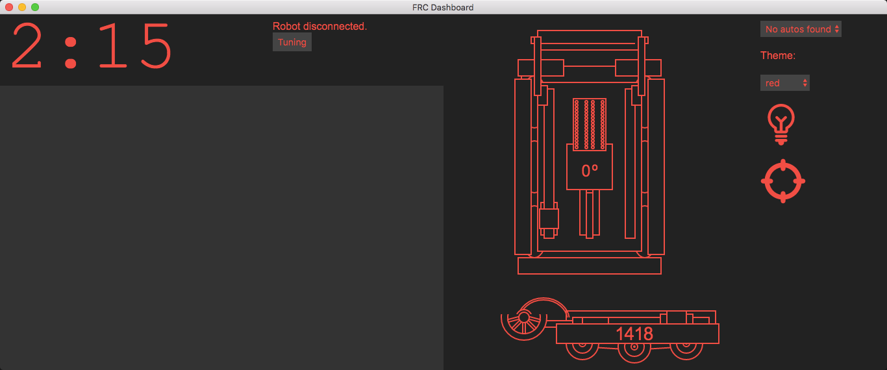

# FRC Dashboard
This is FIRST Robotics Team 1418 Vae Victis' 2016 fork of the FRC Dashboard web driving dashboard framework. FRC Dashboard was built off [our original 2016 UI](https://github.com/frc1418/2016-UI), and this fork is designed as a practice tool to test the ease of development on the framework. Also, [Erik Boesen](https://github.com/ErikBoesen) can't stand to use the old dashboard at our offseason competitions in the fall of 2016.

## Setup
### Dependencies
* Python 3 **(MUST be 3, not 2!)**
* `pynetworktables2js`

        pip3 install pynetworktables2js

    If you don't have administrator privileges, put `--user` at the end of that command.)

If you're going to be using the preferred method of using the dashboard (as an application), you'll also need:
* [`nodejs`](https://nodejs.com) & [`npm`](https://npmjs.com)
    * If you don't have permission to install these, see [this gist](https://gist.github.com/isaacs/579814) for a workaround.
* Electron (to install, `cd` into dashboard directory and run `npm install`)

## Running
1. Connect to your robot's network if you haven't already. (If you're just testing the dashboard and don't currently need to use it with your robot, you can skip this step.)
2. If you are able to use node/npm, use the section below labeled "Using dashboard as Application." If not, use the section titled "Using dashboard through web browser."

### Using dashboard as Application
The preferred method of using the dashboard is to run it using the [Electron](http://electron.atom.io) framework. Your dashboard will be its own application, and will be easy to manipulate.

While in the dashboard directory, run:

    npm start

This will start a Python server and open the dashboard application. Note that you don't have to close and reopen the application every time you make a change, you can just press `Ctrl+R` (`Cmd+R` on Mac) to refresh the application.

### Using dashboard through web browser
The less desirable, but perfectly functional method of viewing your dashboard is to use it like a webpage. This method will work even if you don't have the privileges to install `node.js` and `npm`. The standard toolbars from your browser will still be shown and will take up space on the screen, and the experience will be less fluid, but it will work.

1. Start the Python server independently:

    Windows:

        start py -3 -m pynetworktables2js

    Mac/Linux (using bash):

        python3 -m pynetworktables2js

2. To view the dashboard, use your browser to navigate to `http://localhost:8888`.

It is recommended that while using the dashboard on your driver station, you close the top panel of the FRC DriverStation to make room for the dashboard.

## Authors
* [Erik Boesen](https://github.com/ErikBoesen), design & code, as well as developer of FRC Dashboard
* [Leon Tan](https://github.com/lleontan), UI Lead for the previous version of this UI
* [Tim Winters](https://github.com/Twinters007), code
* [Aki Maher](https://github.com/17mahera), art

Special Thanks to [Dustin Spicuzza](https://github.com/virtuald), mentor and head of the [RobotPy](http://github.com/robotpy) project.

## Modifying
FRC Dashboard is licensed under the MIT license. Basically, modify as much as you like, as long as you give credit to the [original source](https://github.com/FRCDashboard/FRCDashboard) and don't hold us accountable for anything. More information in `LICENSE`.
